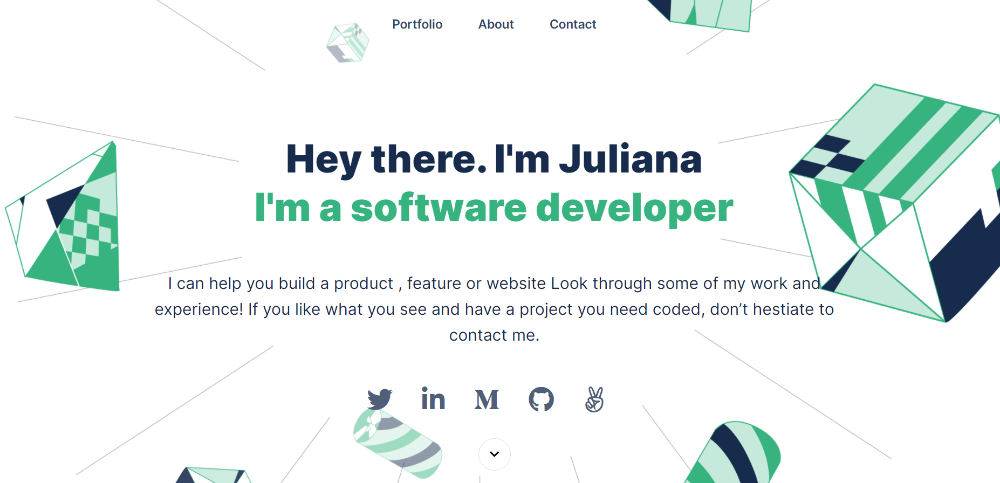
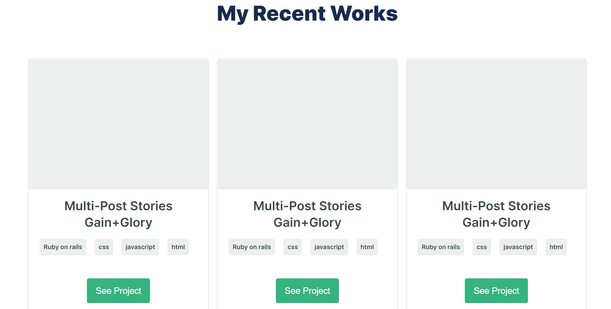
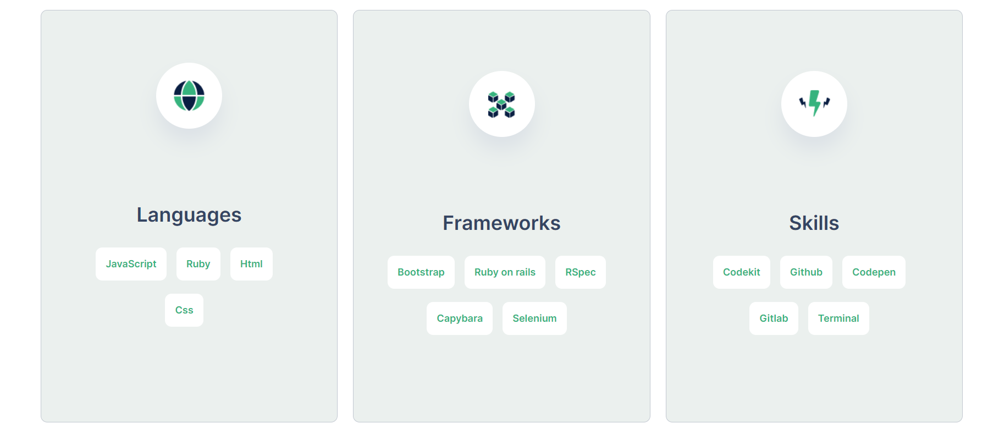
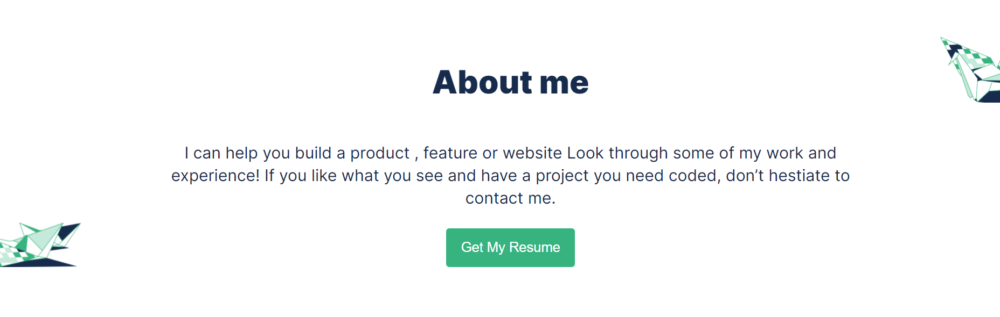
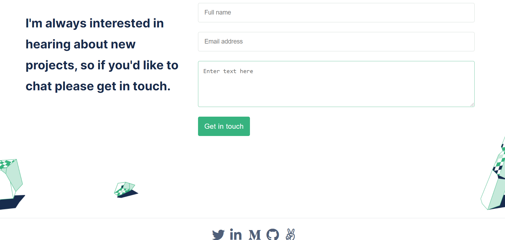

# Portfolio-Mobile-Version

> Desktop version of my portfolio website using figma template.

This project entails Building a mobile and desktop version of my portfolio website from scratch using a design template from figma to replicate the design to my portfolio.

## Built With

- Html
- Css

### Prerequisites

- Text editor
- Git
- Html
- Css

## Live Demo

[Live Demo Link](https://julie-ify.github.io/Portfolio-Mobile-version/)

## Getting Started

To get a local copy up and running follow these simple steps.

- You can clone this repo by typing `git clone git@github.com:julie-ify/Portfolio-Mobile-version.git` on your terminal
- Type `cd Portfolio-Mobile-version` to access the project on the terminal

## Authors

👤 **Ifionu Julie**

- GitHub: [@githubhandle](https://github.com/julie-ify)
- LinkedIn: [LinkedIn](https://www.linkedin.com/in/juliana-ifionu-4a9492212/)

## 🤝 Contributing

Contributions, issues, and feature requests are welcome!

Feel free to check the [issues page](https://github.com/julie-ify/Portfolio-Mobile-version/issues).

## Show your support

Give a ⭐️ if you like this project!

## 📝 License

This project is [MIT](./MIT.md) licensed.
